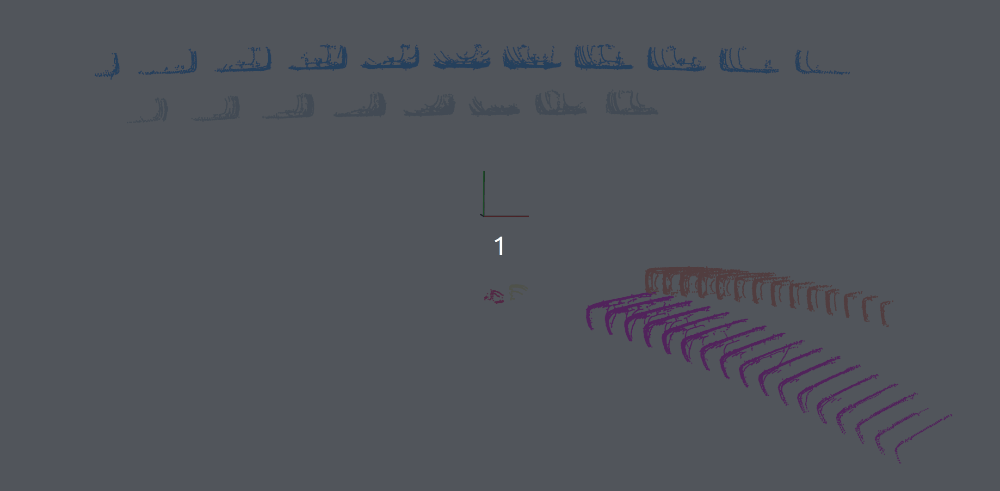
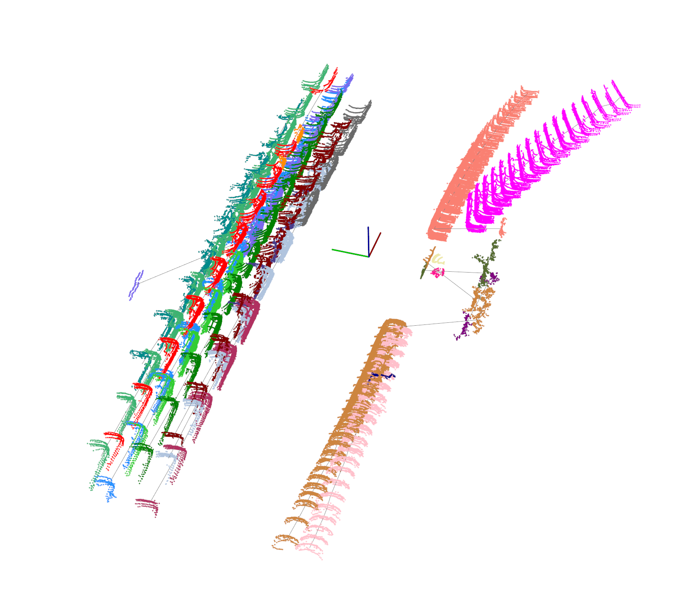
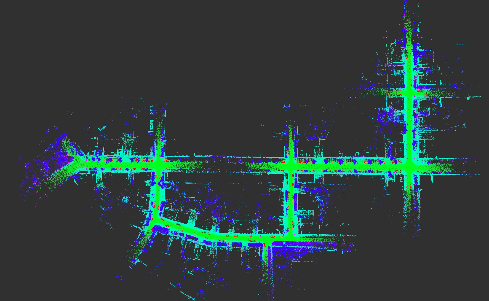
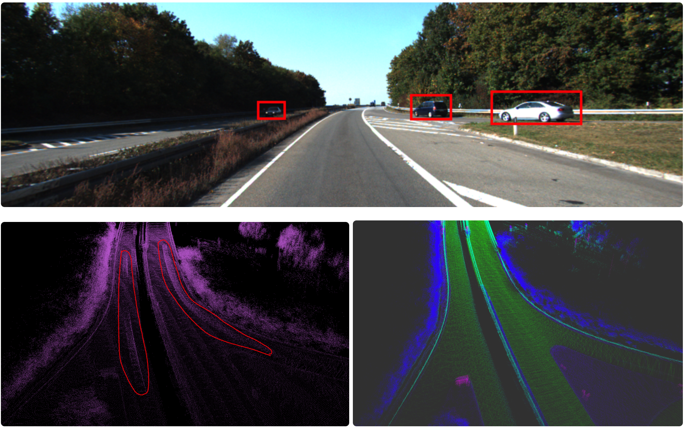
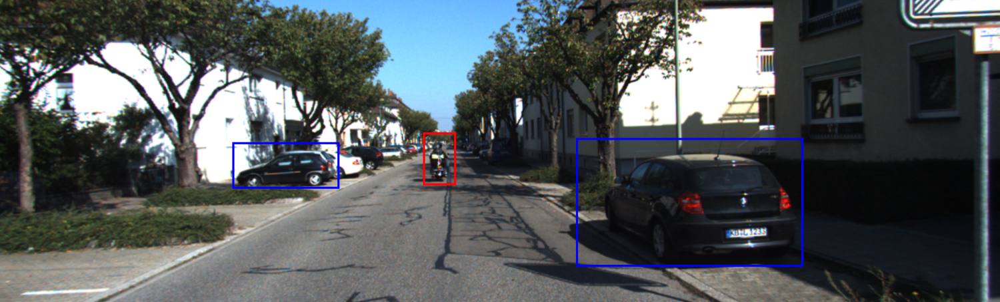
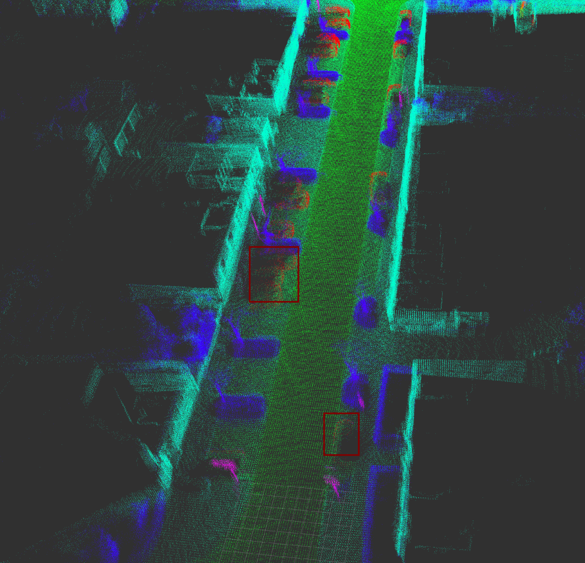

# SLiM:Semantic based LiDAR-inertial Mapping
---
本项目是个人项目的一个简介。

  ## 1 概述

本项目基于激光雷达语义分割信息以及imu里程计信息对动态环境下的动态车辆（行驶中的车辆）、行人等可能影响建图精度的物体进行剔除，同时保留停靠的车辆的点云信息（因为它们的点云也能为里程计的相对位姿估计提供信息）。
在动态场景下剔除掉动态物体后，将提高SLAM的建图和定位精度。

## 动态物体追踪展示
- 下图是SLiM中的多目标追踪算法对分割得到的动态物体追踪的一个效果图，不同颜色的车辆代表不同车辆在不同时刻在雷达坐标系下的位置。

- 下图为在较长一段路程中检测并关联的所有车辆及其轨迹。

## 建图效果展示

- KITTI数据集00序列全局地图

上图中，红色部分为车辆点云，绿色部分为地面点云，粉红色为交通标志，其他颜色为背景。

- 动态物体剔除对比

右下角为SLiM建图得到的地图，能明显看到，场景中的动态物体被剔除了，左下角没有使用SLiM的能明显看到车辆物体的轨迹。

- KITTI00序列开始处的摩托车剔除效果

如上图所示，图像中的摩托车在地图中并未出现，但停靠在路边的车辆依然保留。